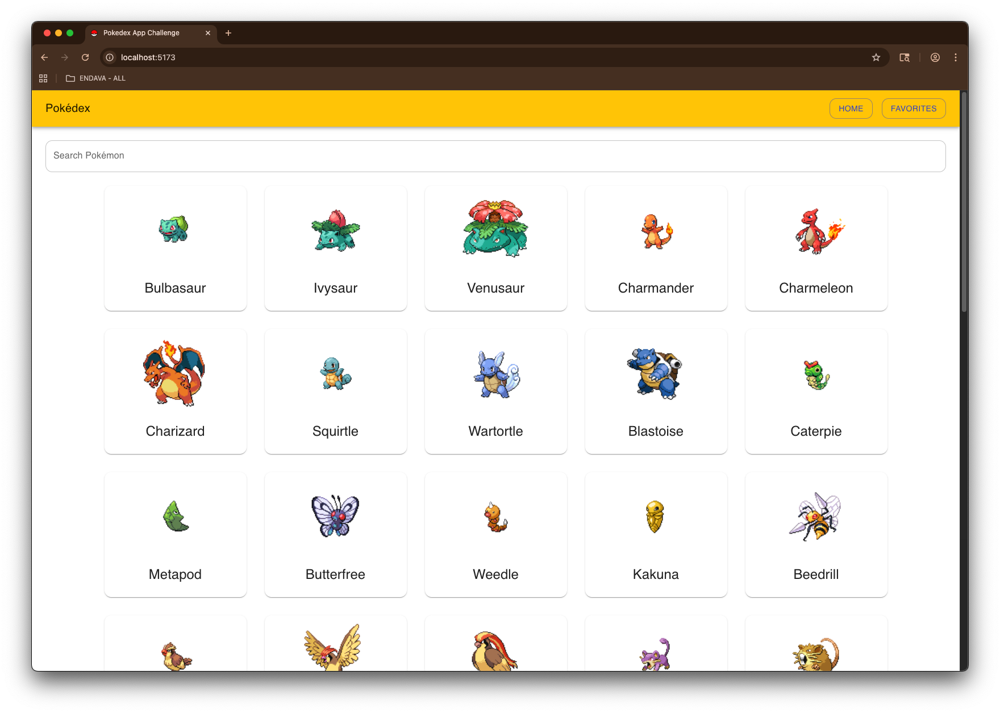
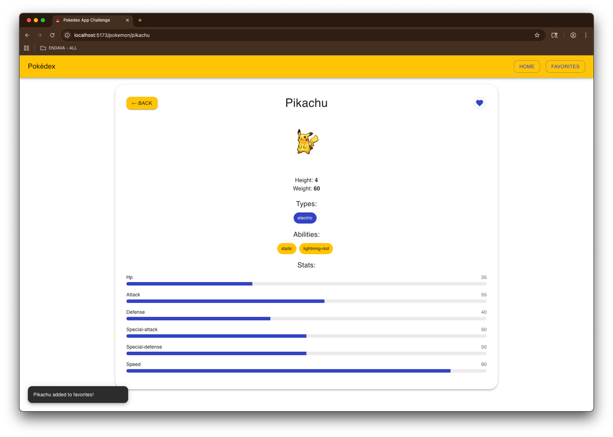

# Pokédex-App-Challenge

This repository contains a full-stack engineering assessment for a Pokédex application.  
It consists of two main apps: a frontend (React + TypeScript + MUI) and a backend (NestJS + TypeScript) that proxies the public PokéAPI and manages favorites.

## Overview




- **Frontend** (`/apps/frontend`): a responsive UI allowing users to browse Pokémon, view details, search by name, and mark favorites.  
- **Backend** (`/apps/backend`): API layer that fetches data from the public PokéAPI, handles favorites (in-memory or persisted), and serves as the data source for the frontend.  
- Shared configuration (TypeScript base config, workspace root) ensures both apps follow consistent standards.

## Tech Stack

- **Frontend**:
  - React with TypeScript
  - React Router DOM
  - Zustand for state management
  - Material UI (MUI) for UI components
  - Axios for HTTP requests
- **Backend**:
  - NestJS with TypeScript
  - Axios for external API calls
  - In-memory favorites store
- **Monorepo Setup**:
  - npm workspaces
  - Root `tsconfig.base.json` for shared TS settings


## Getting Started

### Must have:

- Node.js (>= 16) and npm (>= 8) installed
- Git to clone the repo

### Setup & Run

1. Clone the repo:
   ```bash
   git clone https://github.com/mcb-endava/pokedex-app-challenge.git
   cd pokedex-app-challenge
   ```
2. Install dependencies (root workspace):

    ```bash
    npm install
    ```
3. Run both apps in development:
    ```bash
    npm run dev:frontend   # runs the frontend app
    npm run dev:backend    # runs the backend app
    ```
4. Open http://localhost:5173 in your browser (frontend) and ensure backend is running on http://localhost:3000.


## Application Features (MVP)

- Browse Pokémon list
- Search Pokémon by name (client-side filtering)
- View detailed data for a chosen Pokémon: image, stats, types, abilities, height/weight
- Mark/unmark favorites that are fetched from backend and stored in state
- UI built with Material UI, responsive design
- Backend serves as proxy and manages favorites state

## Testing

Both layers include automated tests:

### Backend

```npm run test:backend```


Runs Jest unit and integration tests for:

- PokemonService
- PokemonController
- FavoritesService
- FavoritesController


### Frontend

```npm run test:frontend```

Runs Vitest + React Testing Library tests for:

- All Components
- Zustand store logic

To view coverage:

```npm run coverage```

## Future Improvements

- Persist favorites to a database (like MongoDB)
- Cache Pokémon detail endpoints to reduce repeated API calls
- Add pagination or infinite scroll for large Pokémon list
- Add theme toggle (light/dark mode)
- Add more advanced search filters (by type, stat, etc.)
- Dockerize both apps
- Add CI/CD workflow with GitHub Actions
- Add Storybook to show reusable components

## Demo

<video controls src="demo/Demo.mov" title="Title"></video>

## License & Acknowledgments

This project is provided as part of an engineering assessment. The public PokéAPI (https://pokeapi.co/) is used for Pokémon data.

Project by: Maria Camila Beltran - Endava